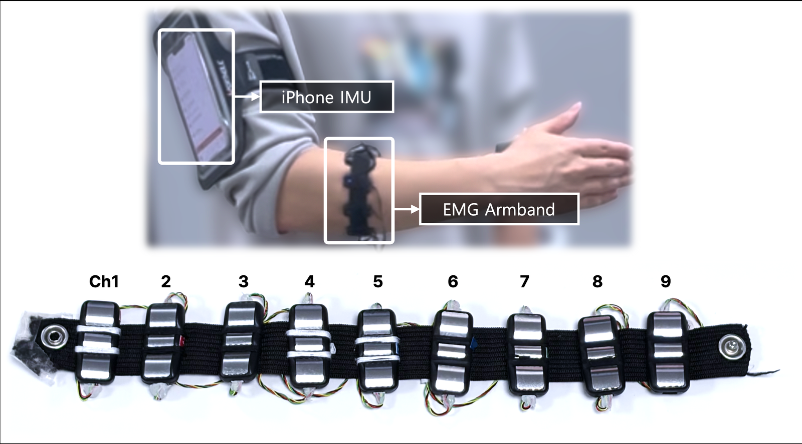
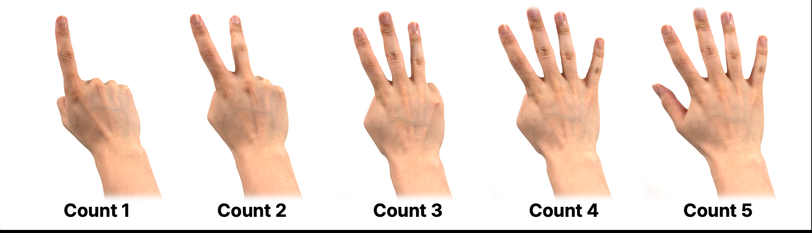
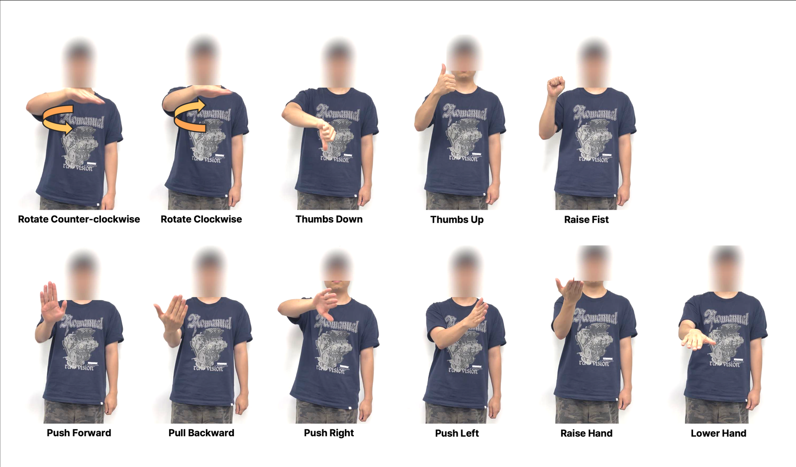
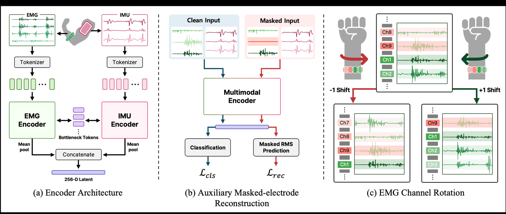

# hui-emg-imu-gesture

<!-- [ [`Paper`](TBD) ] [ [`Data`](https://github.com/suin00h/hui-emg-imu-gesture/releases/tag/v1.0-data) ] [ [`BibTeX`](#citation) ] -->



A gesture dataset for cross-user recognition, pairing surface EMG from a nine-channel forearm band
with inertial data from the upper arm. Eleven people performed sixteen gestures in five sessions
each: eleven arm commands and five finger-counting postures.

The two groups are carried by different sensors and transfer very differently to a wearer the model
has never seen. Given one labelled example per gesture, arm commands reach 84.2% macro-F1 and
counting postures 47.0%. The release includes the one-shot enrollment protocol that gap is measured
under, together with the adaptation methods compared in the paper.

## Setup

```shell
git clone https://github.com/suin00h/hui-emg-imu-gesture.git
cd hui-emg-imu-gesture
pip install -r requirements.txt

python scripts/download.py     # dataset/ (2.2 GB) and checkpoints/ours/
python scripts/verify.py       # checksums, shapes, and one published number
```

`--only S01.h5` fetches a single subject; `--skip-weights` leaves the trained encoders out.

## Data

One file per subject, `S01.h5` through `S11.h5`. Each holds raw 1 kHz EMG from nine electrodes and
100 Hz inertial data from six channels, cut into 1.5 s windows at a 0.2 s step, with a gesture label
and a session index per window. 62,776 windows in total.

Five finger-counting postures:



Eleven arm commands:



Every block is a sequence of repetitions. Participants were told which gesture to perform but not
how many repetitions to make or how fast, so block length and repetition rate vary within and
between people.

Preprocessing is applied by the code rather than baked into the release, so the recordings can be
used with a different front end. See [docs/dataset.md](docs/dataset.md) for the recording procedure
and known irregularities.

## Method



Both modalities are tokenized separately and exchange information only through a small set of shared
bottleneck tokens, giving a 256-d representation per window. Two interventions act during training
and leave inference unchanged: one electrode is hidden at random and its amplitude is predicted from
the rest, and the electrode ring is cyclically shifted by one position.

Held-out subject, one labelled window per gesture, macro-F1 over 636 enrollment episodes:

| | All | Counting | Arm |
|---|---:|---:|---:|
| Prototype Rectification | 72.57 | 46.95 | 84.21 |
| + masked-electrode reconstruction and channel rotation | **76.00** | **49.33** | **88.12** |

The full benchmark, including twelve other adaptation methods, is in the paper.

## Usage

Load one subject. Filtering and decimation are applied here, not in the release:

```python
from src.io import load_subject

emg, imu, label, session = load_subject(1)   # (N, 150, 9), (N, 150, 6), (N,), (N,)
```

Reproduce the benchmark from the released encoders, one per held-out subject:

```shell
for S in $(seq 1 11); do
  python scripts/extract_features.py --checkpoint checkpoints/ours/S$(printf %02d $S).ckpt \
    --target $S --out runs/ours
done
python scripts/run_benchmark.py --features runs/ours --out runs/benchmark.csv
```

Train an encoder instead of downloading one. `--config configs/encoder_baseline.yaml` gives the row
without the interventions; the two files differ only in their `interventions` block:

```shell
python scripts/train_encoder.py --config configs/encoder_ours.yaml --target 1
```

Output goes to `runs/<hash of the config>/`, so two configurations cannot share a feature cache.

Redraw the signal panels used in the paper figures:

```shell
python scripts/make_figures.py
```

See [docs/reproduce.md](docs/reproduce.md) for the ablation and [docs/protocol.md](docs/protocol.md)
for the evaluation protocol.
